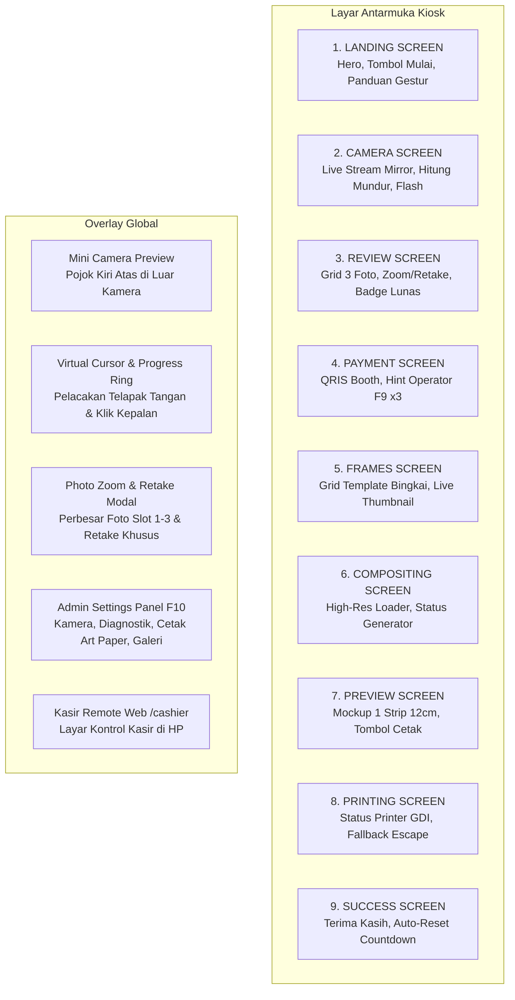

# SYSTEM ARCHITECTURE & UI/UX DESIGN SPECIFICATION
## PhotoboothEXPO-FIKSI — Rencana Tuhan Studio Kiosk

---

## 1. Filosofi Desain & Prinsip UI/UX

PhotoboothEXPO-FIKSI dirancang dengan prinsip **Modern Studio Aesthetic, Zero Friction, and Touchless Ergonomics**. Antarmuka harus terasa futuristik, mewah (*premium*), responsif, dan mudah dipahami dalam hitungan detik oleh pengunjung dari segala kalangan umur tanpa perlu panduan instruksi manual yang rumit.

### 1.1 Prinsip Desain Utama
1. **High Contrast & Visual Punch**: 
   Menggunakan palet warna latar belakang gelap yang elegan (*deep slate / near-black*) dipadukan dengan aksen kuning cerah (*Studio Yellow*) dan gradien neon violet/emerald yang membuat foto subjek menjadi fokus visual utama.
2. **Touchless Ergonomics (Desain Ramah Gestur)**:
   Ukuran tombol minimal `64px` tinggi dengan jarak aman (*spacing*) `16–24px` antar elemen, mencegah salah klik (*miss-trigger*) saat pengguna mengarahkan kursor virtual dengan gestur tangan.
3. **Immediate Visual Feedback**:
   Setiap interaksi gestur memiliki umpan balik visual instan:
   * **Hover**: Tombol membesar (*scale 1.03*), border bersinar kuning terang (*golden halo shadow*).
   * **Hold Fist (✊)**: Cincin kursor virtual terisi melingkar searah jarum jam (*SVG strokeDashoffset progress ring*) selama 350ms sebelum klik tereksekusi.
   * **Hold Peace (✌️)**: Layar menampilkan cincin konfirmasi animasi di tengah layar selama 1.2 detik.
4. **Resilient & Error-Tolerant UX**:
   * Pengguna tidak boleh merasa terkunci (*stuck*): selalu tersedia tombol kembali (`← Back`) yang aman tanpa risiko kehilangan status pembayaran.
   * Transisi layar menggunakan animasi *fade/scale* halus (200–250ms).

---

## 2. Sistem Desain & Token Visual (*Design System Tokens*)

### 2.1 Palet Warna (*Color Palette*)
Sistem menggunakan CSS Custom Properties terpusat yang mendukung tema terang/gelap:

| Token CSS | Kode Warna | Penggunaan Utama |
| :--- | :--- | :--- |
| `--col-bg` | `#0D0F17` | Latar belakang kanvas aplikasi utama |
| `--col-surface` | `#171A26` | Permukaan kartu, panel kontrol, modal |
| `--col-surface-2` | `#212638` | Kartu sekunder, input, baris data diagnostik |
| `--col-border` | `rgba(255, 255, 255, 0.10)` | Garis batas subtil untuk kedalaman antarmuka |
| `--col-border-focus` | `#FDC00F` | Garis batas aktif saat di-hover kursor gestur |
| `--col-yellow` | `#FDC00F` | Warna aksen utama (Brand, CTA Konfirmasi, Fokus) |
| `--col-primary` | `#584EB8` | Aksen sekunder (Gradien brand, tombol sekunder) |
| `--col-success` | `#10B981` | Status Lunas, kamera terhubung, konfirmasi sukses |
| `--col-danger` | `#EF4444` | Notifikasi error, reset, tombol hapus foto |
| `--col-text` | `#FFFFFF` | Tipografi primer (Judul, teks kontras tinggi) |
| `--col-text-2` | `#9CA3AF` | Tipografi sekunder (Instruksi, keterangan, subtitle) |
| `--col-text-3` | `#6B7280` | Tipografi tersier (Metadata, ukuran file, hint kecil) |

### 2.2 Tipografi (*Typography System*)
Sistem tipografi aplikasi mengombinasikan font display modern untuk judul dan font geometris yang sangat terbaca untuk konten:

* **Font Head & Subhead**: `'Coolvetica', 'Poppins', sans-serif` (Coolvetica Regular, Weight 400, Letter-spacing 0.5px)
  * Digunakan untuk: Semua Judul (`h1`–`h6`), Subhead, Title Screen (`.screen h1/h2`), Hero Title (`.landing-title`), Subtitle (`.landing-sub`), Brand Badge (`.brand-badge`), Judul Modal (`.photo-zoom-header-title`, `.settings-header-title`), Header Grup Pengaturan (`.settings-group-title`), Nominal Pembayaran (`.payment-amount`, `.amount-display`), Badge Status (`.status-pill`, `.photo-count-badge`, `.preview-dimensions-pill`).
  * Dimuat secara lokal via `@font-face` dari `/assets/fonts/coolvetica.woff`.
* **Font Deskripsi & Elemen UI**: `'Poppins', system-ui, sans-serif` (Poppins Regular 400 hingga Bold 700/800)
  * Digunakan untuk: Paragraf deskripsi (`p`), instruksi langkah gestur, teks bantuan/hint (`.settings-hint`, `.preview-hint`), tombol interaktif (`.btn`, `.btn-interactive`, `.landing-cta-btn`, `.btn-pay`), label form dan input kontrol, tabel galeri cetak, kartu diagnostik, serta pesan notifikasi toast.
  * Dimuat dari Google Fonts CDN (`weights: 300, 400, 500, 600, 700, 800, 900`).

* **Skala Tipografi**:
  * Display / Hero Title (`.landing-title`): `clamp(56px, 7.5vw, 96px)` — Coolvetica Regular (Grand Kiosk Scale)
  * Heading 1 (Title): `clamp(26px, 3.2vw, 36px)` — Coolvetica Regular
  * Heading 2 (Screen Subhead): `clamp(20px, 2.4vw, 26px)` — Coolvetica Regular
  * Body Large / CTA Button: `clamp(16px, 1.9vw, 20px)` — Poppins Bold (700/800)
  * Body Regular: `clamp(14px, 1.6vw, 16px)` — Poppins Regular (400)
  * Caption / Label: `clamp(12px, 1.4vw, 14px)` — Poppins Medium (500) / Semi-Bold (600)
  * Micro / Hint / Badge: `clamp(10px, 1.2vw, 12px)` — Poppins Semi-Bold (600/700) (Monospace untuk Order ID / File path)

### 2.3 Bentuk & Bayangan (*Border Radius & Shadows*)
* Radius Tombol: `--r-lg: 16px` | `--r-xl: 24px` | Pill: `--r-full: 9999px`
* Shadow Default: `0 10px 25px rgba(0, 0, 0, 0.45)`
* Shadow Glow Kuning (Hover): `0 0 30px rgba(253, 192, 15, 0.45), 0 8px 24px rgba(0, 0, 0, 0.6)`
* Shadow Glow Hijau (Lunas): `0 0 20px rgba(16, 185, 129, 0.35)`

---

## 3. Arsitektur Antarmuka Layar demi Layar (*Screen-by-Screen Layout*)



### 3.1 Layar 1: Landing Page (`#screen-landing`)
* **Tujuan**: Menarik perhatian pengunjung expo yang sedang berlalu lalang dan memberikan instruksi interaksi awal.
* **Komposisi Visual**:
  * Badge Brand: `✨ RENCANA TUHAN STUDIO — EXPO 2026`.
  * Headline Hero: *"Capture Your Fun Moments!"* dengan gradien tipografi tebal.
  * Kartu Panduan Gestur Ringkas:
    * `✋ Buka Telapak`: Gerakkan kursor ke tombol.
    * `✊ Kepal Tangan (Hold 350ms)`: Klik tombol pilihan.
    * `✌️ Dua Jari (Peace Sign)`: Ambil foto langsung.
  * Tombol CTA Utama: `Start Photo Session 📸` (Besar, bersinar, responsif gestur).

### 3.2 Layar 2: Camera Capture Page (`#screen-camera`)
* **Tujuan**: Mengambil 3 foto pose pengunjung secara berurutan.
* **Komposisi Visual**:
  * Kanvas video fullscreen yang di-*mirror* horizontal (seperti cermin).
  * Indikator Pose: 3 bulatan pose di bagian atas (`PHOTO 01 / 03`). Bulatan berubah kuning saat aktif dan hijau centang saat selesai.
  * Teks Panduan Bingkai (*Guidance Text*): Muncul dinamis jika wajah terlalu jauh atau terlalu dekat.
  * Cincin Hitung Mundur (*Countdown Ring*): Angka animasi berdenyut `3 -> 2 -> 1` dengan progress ring memudar.
  * Efek Flash Layar: Lapisan putih 100% transisi cepat (180ms) saat foto tertangkap untuk efek kamera studio autentik.

### 3.3 Layar 3: Photo Review Page (`#screen-review`)
* **Tujuan**: Memberikan kebebasan pengunjung untuk menilai hasil foto dan melakukan foto ulang (*retake*).
* **Komposisi Visual**:
  * Tiga kartu foto berjejer proporsional (aspek rasio 1543:1060).
  * Hover / Focus Hint di setiap kartu: `🔍 Zoom / Retake`.
  * **Badge Pembayaran Lunas (Kondisional)**:
    Jika sesi ini telah lunas (`is_paid == True`), muncul banner hijau:
    `✓ Pembayaran Terkonfirmasi — Foto ulang sepuasnya tanpa bayar lagi`.
  * Tombol Aksi Bawah:
    * `↺ Retake All`: Mengulang ketiga foto dari awal.
    * `Continue to Payment →` (Jika belum bayar) / `Lanjut Pilih Frame (Lunas ✓) →` (Jika sudah bayar).

### 3.4 Modal Zoom Foto Tunggal (`#photo-zoom-modal`)
* Membuka foto resolusi tinggi secara penuh di tengah layar saat salah satu foto di klik.
* Tombol aksi khusus: `↺ Retake Foto 0X Saja`.
* Memungkinkan pengunjung memperbaiki pose yang kurang pas tanpa membuang 2 foto bagus lainnya.

### 3.5 Layar 4: QRIS Payment Page (`#screen-payment`)
* **Tujuan**: Memproses pembayaran retribusi sewa photobooth (Rp 5.000).
* **Komposisi Visual**:
  * Kartu QRIS di tengah dengan bayangan lembut.
  * Nominal jelas: `Rp 5.000`.
  * Gambar QRIS statis booth dengan frame putih bersih berjarak aman dari tepi.
  * Hint Operator Bawah: `Operator: tekan F9 sebanyak 3x setelah pembayaran selesai untuk mengonfirmasi`.
  * Tombol Bantuan: `← Back to Review` dan `⚡ Simulate Payment (Demo)`.

### 3.6 Layar 5: Studio Frame Selection (`#screen-frames`)
* **Tujuan**: Memilih template bingkai kreatif yang sesuai dengan tema event.
* **Komposisi Visual**:
  * Grid frame responsif dengan live preview thumbnail foto pengguna di dalam slot transparan frame.
  * Pilihan frame aktif disorot dengan border emas kuning tebal dan bayangan glow.
  * Tombol navigasi bawah: `← Back` (kembali ke Review dengan status lunas terjaga) dan `Confirm Frame & Composite →`.

### 3.7 Layar 6: Live Preview Strip 12 cm (`#screen-preview`)
* **Tujuan**: Memberikan gambaran nyata hasil lembar foto sebelum benar-benar dicetak ke kertas printer.
* **Komposisi Visual**:
  * Mockup realistis **1 lembar strip frame tunggal** di atas kanvas studio.
  * Dimensi Tag Pill: `📏 Ukuran Cetak: 12.0 cm tinggi (Dilengkapi Garis Potong)`.
  * Tombol Aksi:
    * `🖼️ Ubah Frame`: Kembali memilih desain bingkai lain.
    * `📱 Scan QR / Download`: Membuka modal QR unduhan file digital ke ponsel.
    * `🖨️ Cetak Sekarang (Print 12cm)`: Tombol emas utama berukuran besar untuk mengirim perintah cetak langsung ke printer EPSON.

### 3.8 Layar 7: Printing Status Page (`#screen-printing`)
* **Tujuan**: Menjaga ketenangan pengguna saat printer mekanik sedang bekerja menyemprotkan tinta.
* **Komposisi Visual**:
  * Spinner animasi melingkar halus.
  * Status teks: *"Please wait while the printer prepares your photo..."*.
  * Penghitung waktu real-time: `Elapsed: Xs`.
  * **Fallback Escape Button**: Jika printer lambat atau kehabisan kertas (>60 detik), otomatis muncul tombol `← Back` dan `Next →` agar booth tidak macet total.

### 3.9 Layar 8: Thank You Page (`#screen-success`)
* Ikon bintang perayaan dan pesan apresiasi: *"Thank You! Ambil hasil cetak Anda pada tray printer"*.
* Timer lingkaran hitung mundur 10 detik otomatis kembali ke Landing Page untuk pengunjung berikutnya.

---

## 4. Desain Spesifikasi Output Cetak & Garis Potong (*Print Output Spec*)

Output fisik dirancang khusus untuk kertas **A4 Landscape** dengan pemotongan manual yang cepat, lurus, dan rapi.

```
+-------------------------------------------------------------------------------+
| KERTAS A4 (297 mm x 210 mm)                                                   |
|                                                                               |
|       : : : : : : : : : : : : : : : : : : : : : : (Extension Line)           |
|       +-------------------+                                                   |
|  - -  | FRAME 1 STRIP     | - - -                                             |
|       | Tinggi: 12.0 cm   |                                                   |
|       | Lebar : ~5.48 cm  |                                                   |
|  - -  |                   | - - -                                             |
|       +-------------------+                                                   |
|       : : : : : : : : : : : : : : : : : : : : : :                             |
|                                                                               |
|  ✂ GARIS POTONG (CUT LINE) — Tinggi: 12.0 cm x Lebar: 5.5 cm                  |
+-------------------------------------------------------------------------------+
```

### 4.1 Parameter Geometri Cetak
1. **Ukuran Strip Output**:
   * Tinggi Fisik Strip: **12.0 cm** (Dapat disesuaikan di F10).
   * Lebar Fisik Strip: Menyesuaikan aspek rasio bingkai secara proporsional (~5.48 cm pada rasio 1623:3556).
2. **Kerapatan Piksel (*Resolution*)**:
   * Target DPI: `300 DPI` (Standar cetak foto lab).
   * Dimensi Kanvas A4 Landscape: `3508 x 2480 piksel`.
3. **Anatomi Garis Potong (*Precision Cutting Guides*)**:
   * **Border Dashed Line**: Garis putus-putus abu-abu netral (`rgb(120, 125, 135)`, lebar 3px, dash 18px, gap 12px) tepat di 4 sisi tepi frame luar.
   * **Corner Crop Marks**: Garis siku solid di setiap sudut luar frame (panjang 30px, jarak 3px dari frame).
   * **Extension Guidelines**: Garis putus-putus memanjang dari sudut frame menuju tepi kertas luar untuk memandu awal potongan cutter/gunting dari luar kertas agar tidak melenceng.

### 4.2 Kalibrasi Tinta & Kertas Art Paper (Glossy)
* **Kebutuhan Masalah**: Kertas Art Paper memiliki lapisan permukaan licin/glossy. Jika dicetak dengan mode kertas standar (*Plain Paper*), tinta berbasis air (*dye ink*) akan membanjiri permukaan, warnanya pudar, dan mudah luntur bila disentuh.
* **Solusi Desain Driver DEVMODE**:
  * Parameter `devmode.MediaType = DMMEDIA_GLOSSY (3)`: Memerintahkan firmware Epson untuk menggunakan profil semprotan mikro-tetesan foto (*photo micro-droplet*).
  * Parameter `devmode.PrintQuality = DMRES_HIGH (-4)`: Memaksimalkan kerapatan semprotan tinta hingga resolusi rendering 4125 x 2892 piksel.
  * Parameter `devmode.Color = DMCOLOR_COLOR`: Mengaktifkan pemetaan warna CMYK gamut penuh untuk warna kulit yang cerah dan alami.

---

## 5. Desain Interaksi Gestur & Pelacakan Kursor (*Interaction Engine*)

### 5.1 Pipeline Pelacakan Tangan & Kursor

```mermaid
graph LR
    Cam[Webcam Feed 30 FPS] --> Flip[Mirror Flip]
    Flip --> MP[MediaPipe Hands 21 Landmarks]
    MP --> Norm[Hitung Pusat Telapak Tangan]
    Norm --> EMA[Exponential Moving Average Filter]
    EMA --> Pos[Posisi Virtual Cursor X,Y]
    Pos --> Clsfy[Klasifikasi Gestur: Palm / Fist / Peace]
    Clsfy --> FSM[State Machine Gestur]
    FSM --> Dispatch[Virtual Click / Snap Trigger]
```


### 5.2 Filter Penghalus Gerakan (*Motion Smoothing*)
Untuk menghilangkan jitter alami tangan manusia, posisi kursor dihitung menggunakan filter EMA (*Exponential Moving Average*):
$$X_t = X_{t-1} + \alpha \cdot (X_{raw} - X_{t-1})$$
Dengan faktor kehalusan $\alpha = 0.35$, menghasilkan gerakan kursor yang sangat mulus layaknya mouse optik tanpa lag yang mengganggu.

### 5.3 Mesin Status Gestur (*Gesture State Machines*)
1. **Fist Click Machine**:
   `ARMED` ➔ Terdeteksi kepalan tangan ➔ `PRESSING` (Mulai mengisi progress ring) ➔ Tahan $\ge 350\text{ ms}$ ➔ `TRIGGERED` (Eksekusi klik & register efek) ➔ `WAIT_RELEASE` (Mencegah multi-klik bertubi-tubi sampai kepalan tangan dibuka).
2. **Peace Snap Machine**:
   `NONE` ➔ Terdeteksi pose 2 jari ➔ `HOLDING` (Cincin tengah layar berputar) ➔ Tahan $\ge 1200\text{ ms}$ ➔ `TRIGGERED` (Hitung mundur foto dimulai) ➔ `WAIT_RELEASE`.

---

## 6. Desain Panel Admin (F10) & Halaman Kasir Mobile (`/cashier`)

### 6.1 Panel Admin (F10)
Dirancang dalam bentuk modal *tabbed navigation* responsif dengan tema studio:
1. **Tab Camera**: Kartu deteksi kamera otomatis, status DirectShow/MSMF, live stream test, dan pengaturan mirror/rotasi.
2. **Tab Printer**: Pengaturan nama printer, dropdown **Media Kertas (Glossy/Plain/Matte)**, dropdown **Kualitas Cetak (High/Standard)**, ukuran tinggi strip (cm), jumlah strip A4 (1 atau 2), serta tombol instan **`⚙️ Buka Driver Preferences`**.
3. **Tab Galeri Cetak**: Kartu visual seluruh file foto yang tersimpan, tombol cetak ulang langsung, zoom modal, download, dan tombol buka folder Windows Explorer.
4. **Tab Diagnostics**: Panel real-time FPS inferensi, FPS kamera, status deteksi wajah, dan status printer.

### 6.2 Halaman Kasir Mobile Remote (`/cashier`)
* Dirancang khusus untuk layar ponsel operator (*mobile-first responsive*).
* Komponen:
  * Indikator koneksi live (*pulsing green dot*).
  * Kartu status sesi booth: `MENUNGGU PEMBAYARAN` / `SUDAH LUNAS`.
  * Total tagihan: `Rp 5.000` & Nomor Order ID.
  * Tombol Besar Taktil: `✅ KONFIRMASI BAYAR` (Mengaktifkan getar ponsel saat diklik).
  * Tombol `↺ Reset Booth` darurat jika pengguna meninggalkan booth sebelum selesai.

---

## 7. Rangkuman Spesifikasi Teknis

* **Rasio Aspek Frame Template**: $1623 \times 3556 \text{ px}$ (PNG dengan cutout transparan).
* **Format Lembar Cetak**: A4 Landscape ($3508 \times 2480 \text{ px} @ 300\text{ DPI}$).
* **Tinggi Strip Standar**: $12.0\text{ cm}$.
* **Media Kertas Standar**: Photo Paper (Glossy) untuk Art Paper.
* **Port Layanan Lokal**: `http://127.0.0.1:5000` (Kiosk) dan `http://<IP_LAPTOP>:5000/cashier` (Kasir).
* **Tombol Cepat Keyboard**:
  * `F10`: Membuka / menutup Admin Settings.
  * `F9 (3x dalam 2s)`: Konfirmasi pembayaran manual QRIS.
  * `F11`: Mode Fullscreen browser kiosk.
