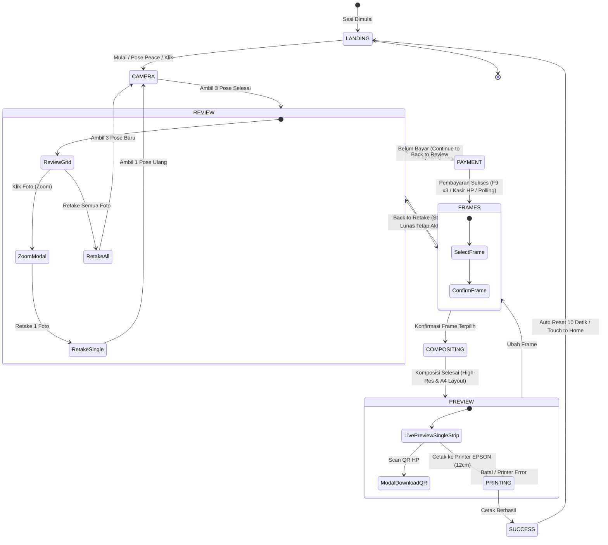

# PRODUCT REQUIREMENT DOCUMENT (PRD)
## PhotoboothEXPO-FIKSI — Kiosk Studio Foto Interaktif

---

## 1. Executive Summary & Ringkasan Produk

| Atribut | Keterangan |
| :--- | :--- |
| **Nama Produk** | PhotoboothEXPO-FIKSI (Rencana Tuhan Studio Kiosk) |
| **Kategori** | Software Kiosk Photobooth Interaktif & Otomasi Cetak Foto |
| **Target Event** | Pameran / Expo Kewirausahaan (FIKSI), Event Sekolah & Studio Booth Komersial |
| **Target Pengguna** | Pengunjung umum expo (siswa, guru, tamu undangan, keluarga) & Operator Kasir Booth |
| **Teknologi Utama** | Python 3.13, Flask, OpenCV, MediaPipe Hands & BlazeFace, Pillow (PIL), Win32 GDI Printing |
| **Versi Dokumen** | 2.4 (Revisi Lengkap Fitur Cetak Art Paper & State Lunas) |

### 1.1 Latar Belakang & Masalah
Pada event expo dan pameran interaktif seperti FIKSI, pengunjung membutuhkan pengalaman dokumentasi visual yang cepat, modern, menarik, dan instan. Kendala photobooth konvensional antara lain:
1. Ketergantungan tinggi pada operator fotografer manual.
2. Layar sentuh yang rentan kotor atau antrean yang berdesakan.
3. Proses pembayaran yang lambat dan rentan salah bayar.
4. Ukuran output cetak yang tidak presisi saat dipotong manual dengan gunting/cutter.
5. Tinta printer yang bleber atau pudar karena salah pengaturan jenis media kertas (misal menggunakan kertas Art Paper namun pengaturan printer masih Plain Paper).

### 1.2 Solusi yang Dihadirkan
PhotoboothEXPO-FIKSI menghadirkan sistem photobooth mandiri (*self-service kiosk*) berbasis web-local responsif dengan kontrol gestur tangan nirsentuh (*touchless AI control*), pembayaran QRIS fleksibel (manual kasir HP / otomatis), live preview strip 12 cm dengan garis potong presisi, dukungan profil warna & media kertas Art Paper (Glossy), serta panel admin komprehensif.

---

## 2. Alur Pengguna (User Flow & State Machine)

Sistem bekerja berdasarkan mesin status (*Finite State Machine*) terstruktur:



---

## 3. Fitur Utama & Spesifikasi Fungsional

### 3.1 Antarmuka Interaktif & Kontrol Gestur Nirsentuh (*AI Gesture Engine*)
* **Pelacakan Tangan & Wajah**: Mengintegrasikan model **MediaPipe Hand Landmarker** dan **BlazeFace** untuk melacak pose tangan dan mengunci pengguna utama (*primary user lock*), mencegah gangguan dari orang di latar belakang.
* **Virtual Cursor & Dynamic HUD**:
  * **Telapak Tangan Terbuka (✋ Hand Tracking)**: Menggerakkan kursor virtual ke tombol antarmuka secara presisi dan halus (*smoothing filter*).
  * **Kepalan Tangan (✊ Hold Fist 350ms)**: Menjalankan aksi klik pada elemen yang diarahkan, dilengkapi animasi lingkaran progres (*progress ring*).
  * **Pose Dua Jari (✌️ Peace Sign 1.2s)**: Menjalankan aksi cepat konteks otomatis:
    * Pada layar Kamera: Memulai hitung mundur foto 3 detik.
    * Pada layar Review: Melanjutkan ke tahap berikutnya.
    * Pada layar Frame: Memilih dan mengonfirmasi frame.
    * Pada layar Preview: Mengirim perintah cetak.
* **Fallback Kontrol Penuh**: Antarmuka tetap mendukung interaksi langsung via Layar Sentuh (*Touchscreen*), Mouse, dan Keyboard.

---

### 3.2 Kamera, Pengambilan Foto & Retake Fleksibel
* **Multi-Backend Kamera**: Mendukung DirectShow (`cv2.CAP_DSHOW`) dan Media Foundation (`cv2.CAP_MSMF`) dengan deteksi *hot-plug* otomatis perangkat webcam USB / eksternal.
* **3-Pose Capture Flow**: Hitung mundur visual 3 detik per pose dengan efek kedip layar (*flash overlay*).
* **Mini Camera Preview**: Feed video miniatur di sudut kiri atas pada seluruh layar selain kamera utama, memastikan pengguna tetap memantau posisi dan deteksi tangan.
* **Fitur Retake Modular**:
  * **Retake All**: Mengulang kembali pengambilan ketiga foto.
  * **Single-Slot Zoom & Retake**: Pengguna dapat mengeklik foto tertentu untuk memperbesar (*zoom modal*) dan hanya mengulang foto pada slot tersebut tanpa menghapus foto lainnya.

---

### 3.3 Sistem Pembayaran QRIS & Keamanan Siklus Sesi (*Retain Paid State*)
* **Mode Pembayaran**:
  1. **Manual QRIS (Offline Ready)**: Menampilkan QRIS statis booth. Konfirmasi pembayaran dilakukan oleh operator menggunakan kombinasi tombol **F9 sebanyak 3x** dalam kurun waktu 2 detik.
  2. **Kasir Remote Web (`/cashier`)**: Halaman khusus operator di smartphone/tablet yang terhubung via WiFi lokal. Menampilkan total tagihan, status sesi real-time, getar notifikasi saat menunggu bayar, tombol **"✅ Konfirmasi Bayar"**, dan tombol reset booth.
  3. **Midtrans Gateway**: Dukungan dinamis API Midtrans QRIS via polling webhook.
  4. **Demo Simulation Mode**: Simulasi bayar instan untuk keperluan uji coba pameran.
* **Retensi Status Pembayaran Lunas (Anti Bayar Ulang)**:
  * Sekali pembayaran terkonfirmasi (`is_paid = True`), status lunas **dikunci untuk seluruh durasi sesi pengguna**.
  * Jika pengguna menekan tombol **`← Back`** dari pemilihan frame ke layar review untuk mengambil foto ulang, sistem **tidak meminta bayar lagi**.
  * Layar review menampilkan badge: `✓ Pembayaran Terkonfirmasi — Foto ulang sepuasnya tanpa bayar lagi`.
  * Tombol aksi otomatis berubah menjadi: `Lanjut Pilih Frame (Lunas ✓) →`.
  * Status lunas hanya di-reset setelah sesi selesai sepenuhnya (*Thank You auto-reset*) atau reset manual booth oleh kasir/admin.

---

### 3.4 Komposisi Frame & Live Preview Strip 12 cm
* **Manajemen Frame Otomatis**: Mendeteksi otomatis file template PNG di folder `frames/`, memetakan slot foto transparan secara dinamis, dan membuat thumbnail resolusi rendah untuk efisiensi loading.
* **Live Preview 1 Lembar Frame**:
  * Tampilan mockup realistis satu lembar strip foto di atas latar belakang bertekstur kertas halus.
  * Menampilkan tag dimensi: `📏 Ukuran Cetak: 12.0 cm tinggi (Dilengkapi Garis Potong)`.

---

### 3.5 Manajemen Cetak Presisi & Kustomisasi Kertas Art Paper
* **Engine Cetak Native Windows (Win32 GDI)**:
  * Berkomunikasi langsung dengan driver printer Windows (misal **EPSON L1210 Series**) melalui struktur `DEVMODE`.
  * Mengatur orientasi kertas ke `DMORIENT_LANDSCAPE` dan ukuran kertas ke `DMPAPER_A4`.
* **Dukungan Media Kertas Art Paper (Glossy)**:
  * **Media Kertas (Tipe Kertas)**:
    * `Photo Paper (Glossy)`: Mengaktifkan profil tinta foto glossy (`DMMEDIA_GLOSSY`), sangat ideal untuk kertas Art Paper & Photo Paper agar semprotan tinta pekat, warna kontras, dan tidak luntur/bleber.
    * `Plain Paper`: Mode kertas standar HVS (`DMMEDIA_STANDARD`).
    * `Matte Photo Paper`: Profil kertas foto doff/matte.
    * `Sesuai Bawaan Driver Printer`: Mengikuti konfigurasi default printer di Windows.
  * **Kualitas Cetak (Print Quality)**:
    * `Kualitas Tinggi (High Quality)`: Mengaktifkan resolusi render foto studio maksimal (`DMRES_HIGH` / 4125 x 2892 px) untuk ketajaman detail foto.
    * `Kualitas Standar (Normal)`: Profil kecepatan cetak normal (`DMRES_MEDIUM`).
* **Format Lembar Cetak A4 Landscape**:
  * Tinggi strip tepat **12.0 cm**, lebar menyesuaikan rasio aspek frame proporsional.
  * Pilihan output: **1 Strip** (hemat kertas dan tinta) atau **2 Strip Kembar** (*Twin Strip*).
* **Garis Panduan Potong Presisi (*Cutting Lines*)**:
  * Garis putus-putus (*dashed line*) presisi tepat di sekeliling 4 sisi border frame.
  * Tanda potong sudut (*Corner Crop Marks*) di setiap sudut luar frame.
  * Garis perpanjangan luar (*extension cutlines*) menuju tepi kertas untuk memandu pisau pemotong/cutter dari luar secara lurus.

---

### 3.6 Akses Digital & Unduh Foto (QR Code Cloudinary)
* **Unggah Awan Otomatis**: Hasil strip foto final diunggah ke Cloudinary CDN di latar belakang.
* **Auto-Download Link**: Tautan QR disematkan parameter transformasi `fl_attachment` sehingga kamera ponsel pengguna yang memindai QR langsung diarahkan untuk mengunduh foto beresolusi tinggi ke galeri ponsel secara instan.
* **Fallback QR Lokal**: Jika koneksi internet tidak tersedia, QR Code dialihkan otomatis ke alamat IP lokal server booth (`http://<IP_LAPTOP>:5000/download/<session_id>`).

---

### 3.7 Panel Admin Komprehensif (Tombol F10)
Dapat diakses kapan saja oleh operator booth dengan menekan tombol keyboard **F10**:
1. **Camera Settings**: Pemilihan perangkat kamera, orientasi rotasi (0°, 90°, 180°, 270°), flip mirror, dan live test stream.
2. **Printer Configuration**:
   * Pemilihan printer tujuan (*target printer*).
   * Pemilihan media kertas (*Photo Paper Glossy, Plain, Matte*).
   * Pemilihan kualitas cetak (*High, Standard*).
   * Pengaturan tinggi strip output (cm) & jumlah strip per lembar A4.
   * Toggle otomatis cetak (*Auto Print on Complete*).
   * Tombol **`⚙️ Buka Driver Preferences`**: Langsung membuka jendela properti driver printer Windows bawaan (Epson Properties dialog) untuk pengaturan tray atau borderless.
3. **📁 Galeri Cetak & Foto Sesi**:
   * Menampilkan seluruh file gambar yang tersimpan di laptop dengan filter: *Semua*, *Sheet Cetak A4*, *Strip Final*, dan *Foto Sesi*.
   * Pratinjau thumbnail, ukuran file, dan tanggal penyimpanan.
   * Fitur **🖨️ Cetak Ulang** langsung ke printer, **🔍 Zoom**, **⬇ Download**, dan **🗑 Hapus**.
   * Tombol **`📂 Buka Folder di Laptop`** untuk langsung membuka folder `photos/` di Windows File Explorer.
4. **Real-time Diagnostics**: Memantau FPS inferensi AI, status gesture, frame per detik kamera, status deteksi wajah, dan status koneksi printer.

---

## 4. Arsitektur Sistem & Direktori File

```
PhotoboothEXPO-FIKSI/
├── assets/                       # Aset statis booth (logo, QRIS statis booth)
│   └── qris.png
├── frames/                       # Template bingkai foto PNG transparan
│   ├── FramePhotoBooth1.png
│   └── dummyframe.png
├── photos/                       # Penyimpanan lokal hasil jepretan, final strip & sheet A4
│   ├── RTS_..._photo_1.jpg       # Foto mentah sesi
│   ├── RTS_..._final.jpg         # Strip hasil komposisi
│   └── RTS_..._a4_landscape.jpg  # Lembar layout siap cetak (12cm + garis potong)
├── blaze_face_short_range.tflite # Model AI deteksi wajah
├── hand_landmarker.task          # Model AI MediaPipe pelacak 21 landmark tangan
├── main.py                       # Core Server (Flask, Vision, Gestures, Printing, Web UI)
├── PRD.md                        # Dokumen Spesifikasi Produk (Dokumen Ini)
└── diag_check.py                 # Skrip diagnostik lingkungan perangkat keras
```

---

## 5. Kebutuhan Perangkat Keras & Perangkat Lunak

### 5.1 Spesifikasi Perangkat Keras (Minimum & Rekomendasi)
* **Laptop / PC**:
  * Prosesor: Intel Core i3 Gen 8 / AMD Ryzen 3 ke atas (Disarankan Core i5 / Ryzen 5 untuk inferensi AI 30 FPS stabil).
  * RAM: 8 GB DDR4 ke atas.
  * Port: Minimal 2x USB 3.0 (1 untuk Webcam HD, 1 untuk Printer EPSON).
* **Kamera**:
  * Webcam USB Full HD 1080p (Logitech C920, C922, atau kamera laptop internal teruji).
* **Printer & Media Kertas**:
  * Printer: Ink Tank Printer Berwarna (Teruji pada **EPSON L1210 / L3110 / L3210 Series**).
  * Kertas: Kertas Foto Glossy / Art Paper A4 (180–230 gsm).
  * Pemotong Kertas: Paper Cutter / Trimmer / Gunting.
* **Layar Tampilan**: Layar Laptop / Monitor Kiosk Touchscreen 15.6" – 24" Full HD (1920x1080).

### 5.2 Spesifikasi Perangkat Lunak
* **Sistem Operasi**: Windows 10 / Windows 11 (64-bit).
* **Python**: Python 3.10 – 3.13 (64-bit).
* **Driver Printer**: Driver resmi EPSON Windows terinstal lengkap.
* **Browser Kiosk**: Google Chrome / Microsoft Edge dalam mode Fullscreen (F11).

---

## 6. Matrix Pengujian & Kriteria Keberhasilan (Acceptance Criteria)

| Skenario Pengujian | Hasil yang Diharapkan | Status |
| :--- | :--- | :--- |
| **Deteksi Gestur Tangan** | Telapak tangan memunculkan kursor virtual; kepalan tangan (✊) mengklik tombol; peace sign (✌️) memicu timer foto. | **LULUS** |
| **Pengambilan Foto & Retake** | 3 foto diambil berurutan; pengguna bisa memperbesar foto individual dan mengulang foto tersebut tanpa menghapus foto lainnya. | **LULUS** |
| **Pembayaran Manual F9 x3** | Menekan F9 sebanyak 3x mengonfirmasi pembayaran dan melompat ke pemilihan frame. | **LULUS** |
| **Web Kasir Remote HP** | Halaman `/cashier` di HP menampilkan order ID, tagihan Rp 5.000, dan tombol konfirmasi dapat meloloskan pembayaran booth. | **LULUS** |
| **Retensi Status Lunas** | Pengguna yang sudah bayar lalu menekan `← Back` dan mengambil foto ulang dapat langsung lanjut memilih frame tanpa diminta bayar lagi. | **LULUS** |
| **Dimensi Cetak 12 cm** | Lembar cetak A4 memiliki tinggi strip tepat 12 cm dengan garis putus-putus rapi di sekeliling frame dan tanda potong sudut. | **LULUS** |
| **Media Art Paper (Glossy)** | Pilihan `Photo Paper (Glossy)` dan `High Quality` di panel F10 mengirim perintah GDI DEVMODE ke EPSON agar tinta tidak bleber dan warna pekat. | **LULUS** |
| **Galeri Cetak F10** | Seluruh hasil foto tersimpan dapat dilihat di panel admin, dicetak ulang, diunduh, dihapus, atau dibuka foldernya di Explorer. | **LULUS** |

---

## 7. Penutup & Rencana Pengembangan Mendatang
PhotoboothEXPO-FIKSI telah berhasil dikembangkan dengan arsitektur modular yang stabil dan siap operasional (*production-ready*) untuk event pameran dan komersial booth foto. 

Rencana pengembangan fase selanjutnya mencakup:
* Integrasi filter warna visual instan (*Vintage, B&W, Warm Tone, Cyberpunk*).
* Animasi GIF pendek / Boomerang sebelum komposit frame.
* Pilihan pembayaran QRIS dinamis multi-eWallet dengan status auto-detect langsung di layar kiosk tanpa perlu konfirmasi operator.
